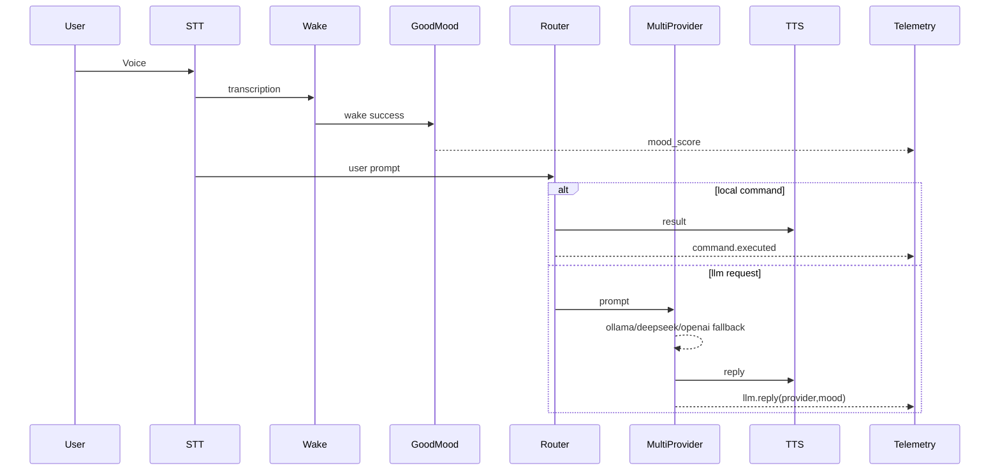

# Jarvis Architecture — Ironman Grade

## Runtime Katmanları
1. **Input Layer**: Mic + STT + Wake Word
2. **Mood Layer**: GOODMOOD scoring
3. **Decision Layer**: CommandRouter + MCP gate
4. **Brain Layer**: MultiProviderRouter (Ollama -> DeepSeek -> OpenAI)
5. **Output Layer**: Piper TTS + optional OpenAL FX
6. **Observability**: Telemetry JSONL + Rich Live Ops

## Sequence


## Data Contracts
Telemetry JSONL satırı:
```json
{
  "ts": 1713780000.12,
  "level": "info",
  "event": "llm.reply",
  "payload": {
    "provider": "deepseek",
    "mood_score": 87.4,
    "chars": 142
  }
}
```
