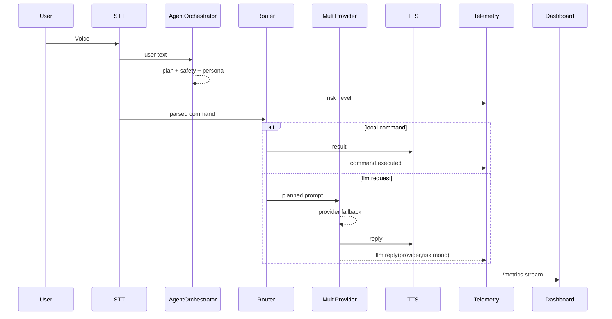

# Jarvis Architecture — Ultimate Professional Stack

## Runtime Katmanları
1. **Input Layer**: Mic + STT + Wake Word
2. **Agent Layer**: PlannerAgent + SafetyAgent + PersonaAgent
3. **Decision Layer**: CommandRouter + MCP gate
4. **Brain Layer**: MultiProviderRouter (Ollama -> DeepSeek -> OpenAI)
5. **Output Layer**: Piper TTS + optional OpenAL FX
6. **Observability**: Telemetry JSONL + FastAPI `/metrics` + Web Dashboard `/dashboard`

## Sequence


## Data Contract (LLM reply)
```json
{
  "event": "llm.reply",
  "payload": {
    "provider": "ollama",
    "risk_level": "low",
    "mood_score": 88.1,
    "chars": 164
  }
}
```
