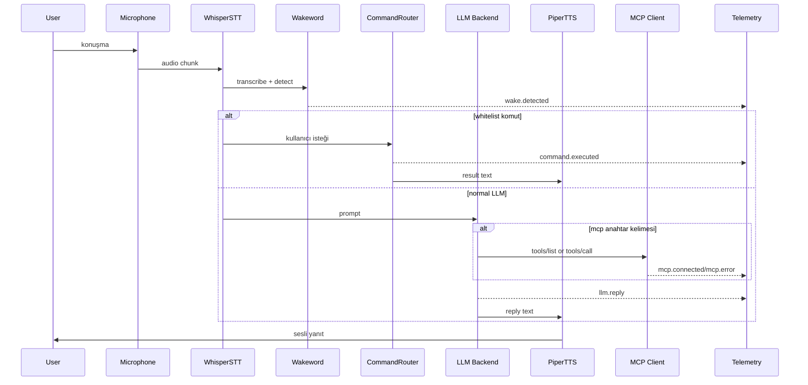

# Jarvis Architecture & Data Contracts

## 1) Runtime Bileşenleri
- `main.py`: Orkestrasyon döngüsü
- `audio.py`: Mikrofon kayıt chunk'ları
- `stt.py`: Ses->metin
- `wakeword.py`: Tetik kelime doğrulama
- `commands.py`: Güvenli komut whitelist
- `backends/*`: LLM sağlayıcıları
- `tts.py`: Metin->ses
- `integrations/mcp_client.py`: MCP stdio bağlantısı
- `telemetry.py`: Event logging
- `ui_console.py`: Operasyon paneli

## 2) Sequence Diagram


## 3) Telemetry JSONL Sözleşmesi
Her satır bağımsız bir JSON eventidir:

```json
{
  "ts": 1713780000.12,
  "level": "info",
  "event": "user.prompt",
  "payload": {
    "text": "jarvis not defteri aç"
  }
}
```

## 4) MCP Server Sözleşmesi
`mcp_servers.json`:
```json
[
  {
    "name": "filesystem",
    "command": ["npx", "-y", "@modelcontextprotocol/server-filesystem", "C:\\Users\\Public"]
  }
]
```

## 5) Deployment Profilleri
- **Edge/Offline**: Ollama + Piper + Whisper CPU
- **Hybrid**: OpenAI + Piper + Whisper
- **Debug/Visual**: `--visual` ile canlı panel + JSONL telemetri
