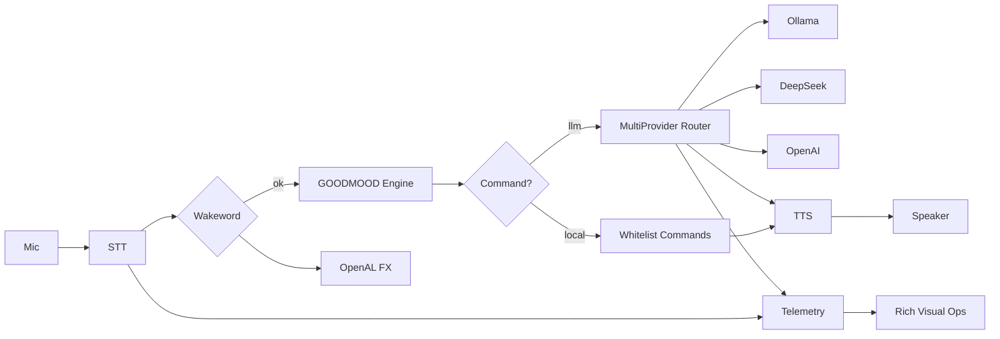

# Jarvis (Windows) — IRONMAN + GOODMOOD + Multi-LLM

Bu sürümde Jarvis, **IRONMAN HUD tarzı**, **GOODMOOD skoru**, **çoklu sağlayıcı fallback** ve **telemetri tabanlı görsel operasyon** ile yükseltildi.

## Modlar
- `local`: Wake-word + Whisper + Ollama + Piper
- `hybrid`: Wake-word + Whisper + DeepSeek/OpenAI + Piper

## Yeni Özellikler
- **GOODMOOD Engine**: kullanıcı etkileşimine göre mood skoru üretir.
- **IRONMAN Persona**: `--ironman` ile yüksek teknoloji ton + HUD prefix.
- **Multi Provider Router**: `BRAIN_PROVIDERS=ollama,deepseek,openai` sıralı fallback.
- **DeepSeek Backend**: OpenAI-compatible endpoint desteği.
- **OpenAL FX (opsiyonel)**: wake anında kısa `arc reactor` ping efekti.
- **Visual Ops Panel**: `--visual` ile canlı durum ekranı.

## Hızlı Başlangıç
```powershell
cd C:\jarvis
python -m venv .venv
.\.venv\Scripts\activate
pip install -r requirements.txt
copy .env.example .env
copy mcp_servers.example.json mcp_servers.json
```

## Çalıştırma
```powershell
python -m jarvis.main --mode local --visual --ironman
python -m jarvis.main --mode hybrid --visual --ironman
```

## Mimari Akış


## Güvenlik
- Beyaz liste dışı komutlar yerel shell olarak çalıştırılmaz.
- Hatalarda fallback ve kontrollü yanıt üretimi vardır.
- API anahtarları sadece `.env` dosyasında tutulur.
