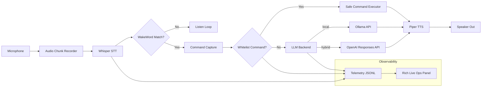

# Jarvis (Windows) — Local + Hybrid + Visual Ops

Bu proje, Windows açılışında otomatik başlayan ve **operasyon paneli + telemetri** sunan bir sesli asistan iskeleti sağlar.

## Modlar
- `local`: Wake-word + Whisper + Ollama + Piper (tamamen yerel)
- `hybrid`: Wake-word + Whisper + OpenAI + Piper

## Teknoloji Yığını
- Wake Word: `openWakeWord` (opsiyonel)
- STT: `faster-whisper`
- LLM: `Ollama` veya `OpenAI`
- TTS: `Piper`
- UI: `rich` canlı panel (`--visual`)
- Telemetri: JSONL event stream (`telemetry/events.jsonl`)
- MCP: stdio JSON-RPC client (`initialize`, `tools/list`, `tools/call`)

## Mimari Şema


## Veri Akışı (Event Tipleri)
- `jarvis.started`
- `audio.heard`
- `wake.detected`
- `user.prompt`
- `command.executed`
- `llm.reply`
- `mcp.connected` / `mcp.error`

## Kurulum
```powershell
cd C:\jarvis
python -m venv .venv
.\.venv\Scripts\activate
pip install -r requirements.txt
copy .env.example .env
copy mcp_servers.example.json mcp_servers.json
```

## Çalıştırma
```powershell
python -m jarvis.main --mode local
python -m jarvis.main --mode hybrid
python -m jarvis.main --mode local --visual
```

## Windows başlangıç
Görev Zamanlayıcı:
- Trigger: At log on
- Action: `C:\jarvis\.venv\Scripts\python.exe -m jarvis.main --mode local --visual`

## MCP server örneği
`mcp_servers.json` içine server komutları eklenir:
```json
[
  {
    "name": "filesystem",
    "command": ["npx", "-y", "@modelcontextprotocol/server-filesystem", "C:\\Users\\Public"]
  }
]
```

## Güvenlik Notları
- Komutlar beyaz liste ile sınırlandırılır.
- Tehlikeli shell operasyonları doğrudan açılmaz.
- Hibrit modda API anahtarı yalnızca `.env` içinde tutulur.
